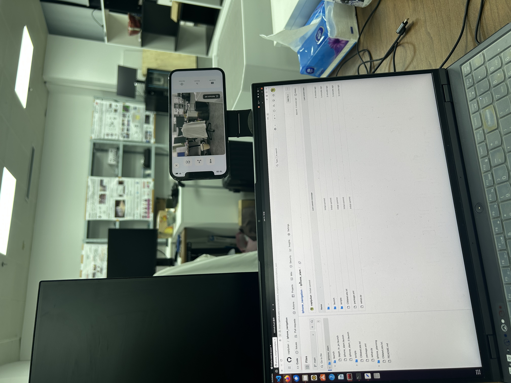
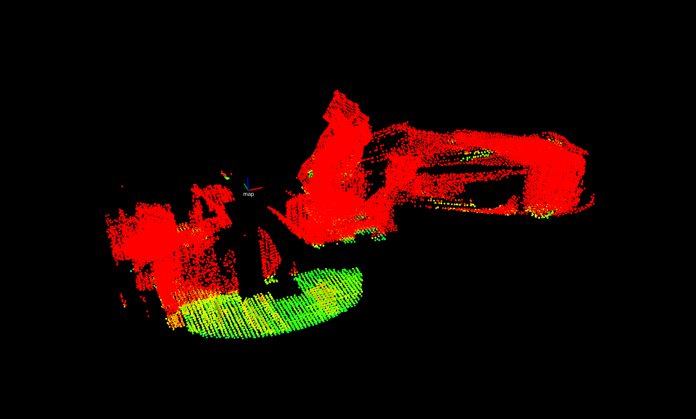

# iphone_navigation
git clone git@github.com:captjulian/iphone_navigation.git

catkin_make

运行asMagic

roslaunch iphone_slam iphone_slam_0.launch (得到tf，注意现在的tf为下图所显示摆放，更改摆放方法，需要重新调整tf)

roslaunch iphone_slam depth_to_pc.launch (得到点云)

roslaunch vehicle_simulator system_real_robot.launch (运行planner，注意需要先固定好，手机与机器人本体的相对位置，而后更改，iphone_planning/local_planner/launch/local_planner.launch 中sensor与vehicle的相对位置，出现下图说明正确，最后需要将输出的速度乘以一个0.x，因本planning为轮式机器人设计，可能输出速度较大，造成足式机器人损坏)

